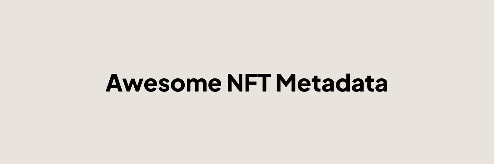

---

Curating the best NFT **metadata** resources, documentation, and project-specific efforts.

## Sections

- [Organizations](#organizations)
- [Resources](#resources)
- [Storage Mediums](#storage-mediums)
- [Preservation](#preservation)
  - [What is preservation?](#what-is-preservation)
  - [Project Specific Efforts](#project-specific-efforts)

---

## Organizations 
Groups of people that have subject-matter expertise around NFT metadata 

* [Pob Studio Preservation Initiative](https://pob.studio/preserve) - NFT Studio offering a complete preservation solution to distressed NFT collections.
* [NFT Storage](https://nft.storage) - Organization focused on long term archiving and storing of IPFS files with a particular focus around NFT metadata.

---

## Resources
Guides and other resources on NFT preservation for collectors, NFT artists, developers, and communities

* [NFT Cheat Sheet](https://www.pob.studio/learn/metadata-cheat-sheet) - A comprehensive guide around best practices around NFT metadata design
* [Data integrity and $345 million worth of missing NFTs](https://blog.nft.storage/posts/2022-04-04-missing-nfts) - Some description here
---

## Storage Mediums
Decentralized solutions designed to enable long term data storage, retrieval and archival.

* [IPFS](https://ipfs.tech/) - A file resolution system to discover content on a decentralized environment
* [Arweave](https://arweave.org/) - A blockchain with a novel consensus to provide decentralized "permanent" storage
* [Irys.xyz](https://irys.xyz/) - 

---

## Preservation 

### What is preservation?
TODO

### Project Specific Efforts
Documentation for specific initiatives to help preserve NFT collections 

* [Gen.art](./projects/gen-art.md) - Generative art platform that shutdown in 2023, Pob Studio stepped in to help archive and push NFT metadata to IPFS
* [Known Origin](./projects/) - NFT art platform. Pob Studio + NFT.Storage w/ the help of KO core team, helped archive and secure NFT metadata.

# Contributing

Contributions welcome! Read the [contribution guidelines](CONTRIBUTING.md) first.

# License

To the extent possible under law, [Pob Studio](https://pob.studio) has waived all copyright and related or neighboring rights to this work.